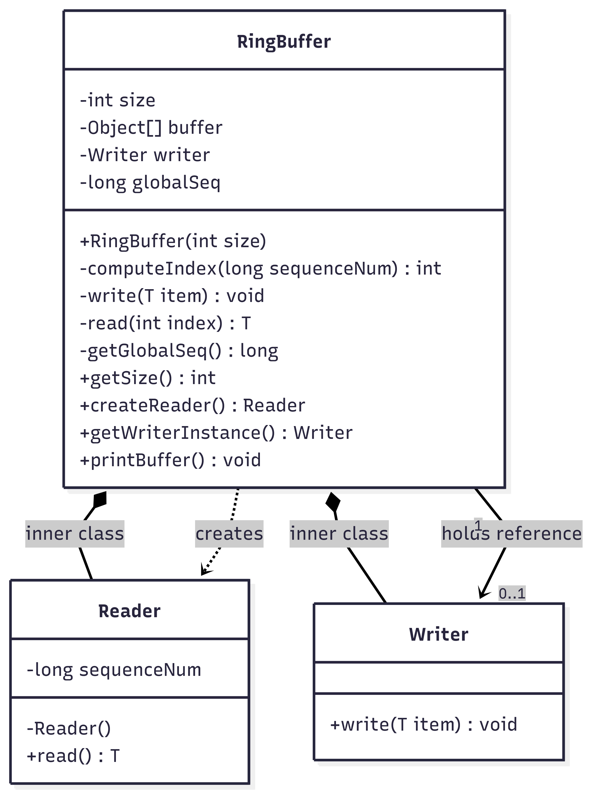
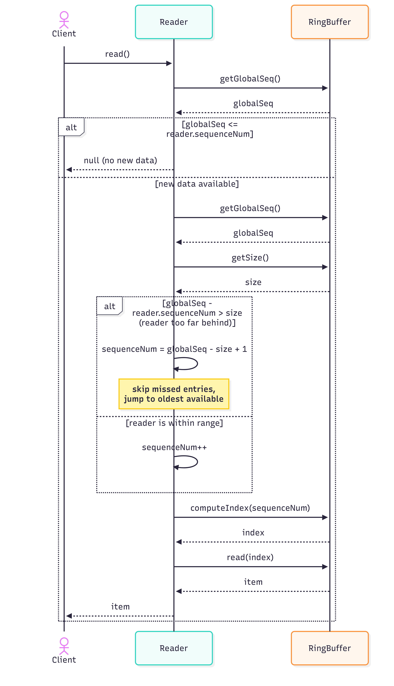
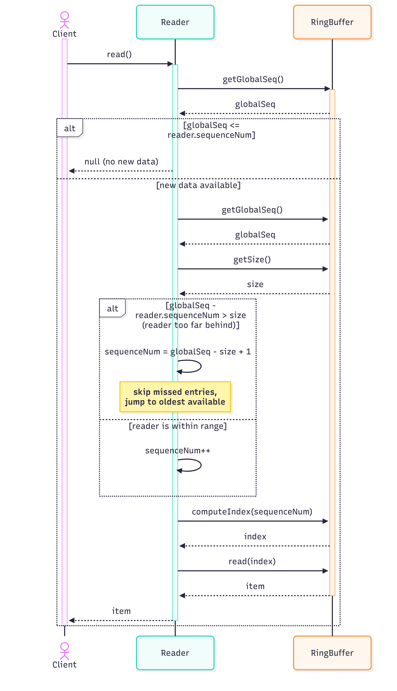

# Ring Buffer

This project implements a simple version of **[Ring Buffer](https://en.wikipedia.org/wiki/Circular_buffer)** with multiple readers and one writer.
The Ring Buffer has a fixed capacity of `N` elements.
If the end of the structure is reached, reading resumes from the beginning (thus forming a ring).
Multiple readers can read from the buffer at different positions.
However, the writer can overwrite oldest information (even if still unread by some readers) if there is no free space available.

The project has a demo file, `Main.java`, that you can run to test the implementation.

Note: This implementation is **not** thread-safe.

---

## Running and testing

To run this project, you need to have Java installed on your computer.
The project was written using JDK 21 and thus it is the recommended JDK version to use.
However, it is likely that the project is compatible with the older versions due to its simplicity.

The `Main.java` file contains a demo of the implementation. You can use an IDE like IntelliJ IDEA to run it. Alternatively, you can do the following:

1. Change the directory to `src`:
   ```
   cd src
   ```
1. Compile the classes:
   ```
   javac Main.java RingBuffer.java -Xlint:unchecked
   ```
1. Run the demo:
   ```
   java Main
   ```

To test the project, you can modify the `Main.java` directly.
You can use the `printBuffer()` debug method from `RingBuffer` to print the internal array.
Use `read()` and `write(item)` from `Reader` and `Writer`, respectively, to perform operations on the Ring Buffer.

## Design

The Ring Buffer (`RingBuffer.java`) is designed as a single class, `RingBuffer`, with two nested classes: `Reader` and `Writer`.

### Class `RingBuffer`

This class contains the internal structure of the Ring Buffer (an array of fixed size `N`), the single `Writer` instance, and the global sequence number.
The main responsibility of this class is to handle calls from `Reader` and `Writer` by accessing the array directly and to track and modify the global sequence number.
The global sequence number indicates how many writes to the Ring Buffer have occurred up to a certain point in time.
The index to use in the array is then calculated using modular arithmetic:

```
index = sequenceNum % N
```

`RingBuffer` also provides an API to create readers and get the writer instance as the direct instantiation of these is not allowed.

### Class `Reader`

This class contains the reading logic. Each `Reader` instance tracks its own sequence number that indicates the position of the last read item in the Ring Buffer.
The `read()` method allows users to read from the Ring Buffer. During the reading, three events may happen:

1. **Reader's sequence number is smaller than the global sequence number but the distance between them is bigger than `N`**.
   This means that the item at reader's current internal sequence number has been overwritten and thus might not be the oldest one available because of the circular structure of the Ring Buffer.
   In this case, the reader "jumps" to the oldest item (`globalSeq - N + 1`) and returns it.
1. **Reader's sequence number is smaller than the global sequence number and the distance between is smaller than `N`**.
    There is some item that has not been yet read; it is returned.
1. **Reader's sequence number is larger or equal to the global sequence number**.
   This indicates that the reader has already read the newest available item and there are no items beyond this point. In this case, `null` is returned.

### Class `Writer`

This class is a singleton that allows the users to write to the Ring Buffer. Its `write(item)` method relays the data to `RingBuffer`, which updates the array and the global sequence number.

## UML Diagrams

### Class Diagram


### Read Sequence Diagram


### Write Sequence Diagram

